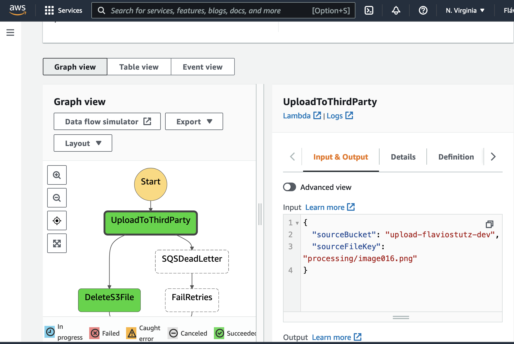
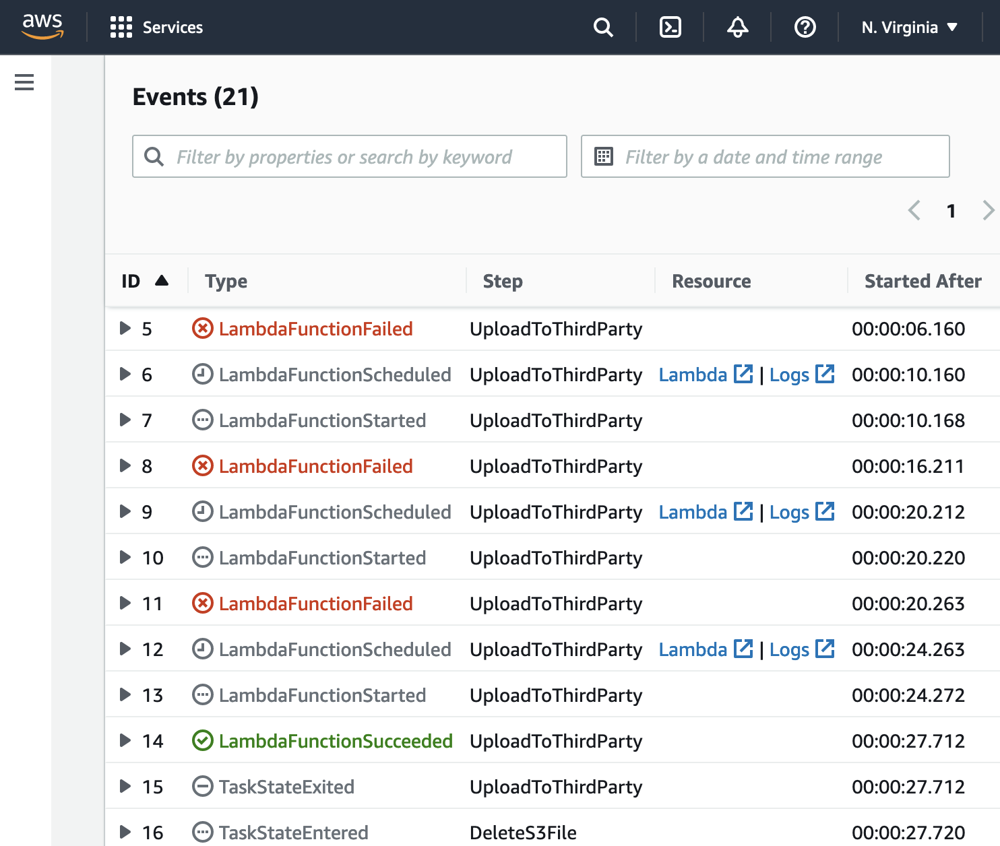

# lambda-async-file-upload

This is a demo of how to define step functions using Serverless Framework.

[](https://youtu.be/OZWFlgPxJpU)
[](https://youtu.be/OZWFlgPxJpU)

[See a walkthrough video here](https://youtu.be/OZWFlgPxJpU)

## Specification

We have a third party service that is unavailable from time to time then we need a way that will receive those files and upload them as soon as possible.

The solution is a REST service that schedules the uploading of a certain file in a S3 bucket to the third-party service as soon as the service gets available.

## Design

We have a REST service that will instantiate a Step Function workflow responsible for sending the file. If for some reason it's not possible to send a specific file for more than 3 days, we mark the workflow as failed and send the file upload requeset to a DeadLetterQueue in SQS, so we can analyse later the reason and eventually retry manually those cases.

For details about the workflow, see the spec at serverless.yml.

Reference: https://github.com/serverless/blog/blob/master/posts/2017-09-18-how-to-manage-your-aws-step-functions-with-serverless.md

## How to run

* Configure your serverless with AWS credentials

* Open serverless.yml and change the S3 bucket name to something different from 'upload-flaviostutz' because this must be unique among all AWS accounts in the same region

* Deploy the stack

```sh
sls deploy --verbose
```

* Open AWS console, find S3 bucket 'upload-[name you used]-dev' and upload any file to folder 'tmp'

* From the output of the deploy run, get the URL from the endpoint that ends with '/schedule-upload'

* Schedule the asynchronous processing of this file by calling the endpoint

```sh
curl -X POST [URL from deploy ouput]/schedule-upload?file=[name of the file you uploaded to tmp]
```

* Open StepFunction on AWS Console and check the executions of the steps related to the file

